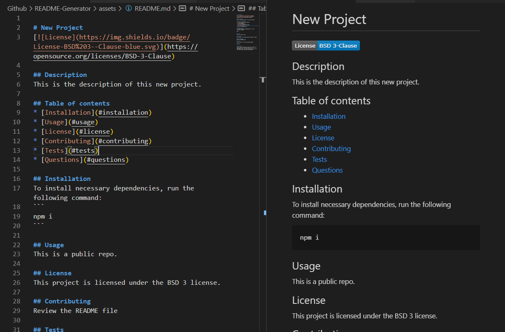
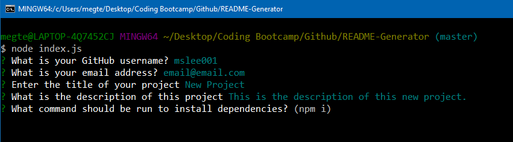
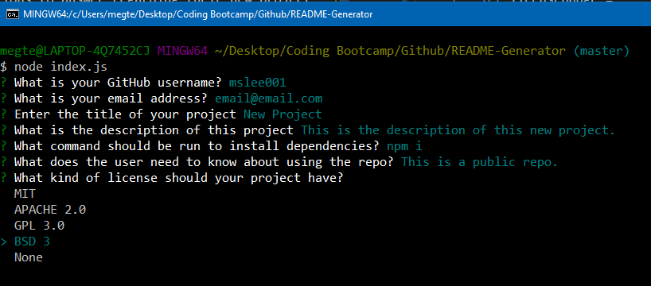
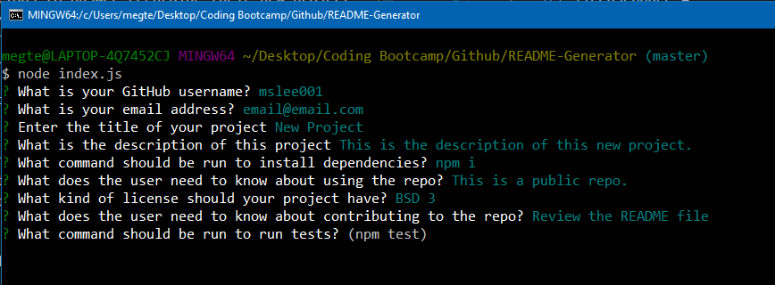
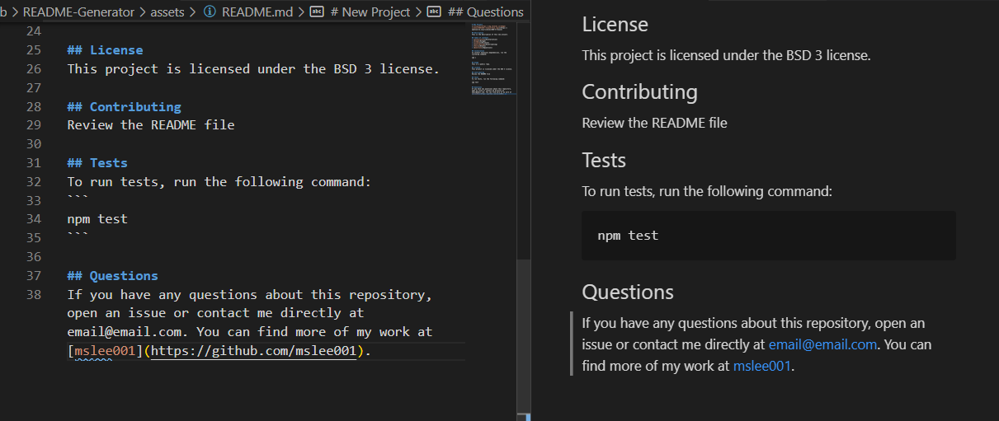

# README Generator CLI Application

## Description
Using the command line with node.js and the inquirer package, a user is given a series of specific questions to answer regarding their new project. Once the user has completed answering all the questions, a professional README file is generated with the following sections: Title, Table of Contents, Installation, Usage, License, Contributing, Tests, and Questions.


The installation question will default to `npm i`, however the user is able to change this if needed.


There will be a list of different license badges (MIT, APACHE 2.0, GPL 3.0, BSD 3, None) the user can select from. When a license is selected, the badge will display below the title and the license information will display within the license section.


The testing question will default to `npm test`, however the user is able to change this if needed.


The user's github username and email address are added as contact information to the questions section.


## Table of contents
* [Installation](#installation)
* [Usage](#usage)
* [License](#license)
* [Contributing](#contributing)
* [Tests](#tests)
* [Questions](#questions)
        
## Installation
To install necessary dependencies, run the following command:
```
npm i
```

## Usage
This is a public repository. 

## License 
This project is licensed under the None license.

## Contributing
No contributing allowed at this time.

## Tests
To run tests, run the following command:
```
There is no testing available at this time.
```

## Questions
If you have any questions about this repository, open an issue or contact me directly at megtej@gmail.com. You can find more of my work at [mslee001](https://github.com/mslee001).